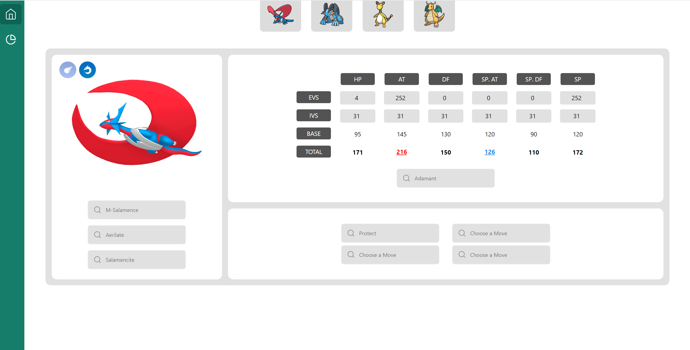

# Pokemon Battle Maison Ultimate
My name is **Yuri** and I'm a Computer Scientist in Galicia, Spain. I've started this project in order to improve the capabilities of my Pokemon Team in Pokemon Omega Ruby and Alpha Sapphire in the Battle Maison. 

Driven by my love for both programming and Pokemon, I've utilized advanced webscraping techniques in Python 3.10 to gather all the necessary information for my project. Even I had translations for Spanish and English. With this precise and valuable data, I consider that this application can leverage and gain a competitive advantage in the Battle Maison of XY or ORAS.

But my efforts go even further. To present this information in an intuitive and user-friendly manner, I have been developing a Cutting-Edge Frontend Project with Vue. Vue is an up-to-date Frontend Framework whose main principle is reactivity: changes alters the data. In other words, I've crafted an exceptional interface that showcases the full potential of my Pokemon Team.


<br> 
<div style="text-align:center" align="center">
  
</div>

[comment]: [](https://weatherdelta.vercel.app)
## Project setup

1. To set up the project, you'll need to have Node.js and npm installed on your machine. You can download and install them from the [official Node.js website](https://nodejs.org/).

2. Clone this repository using Git Bash:

```bash
git clone https://github.com/juanyuri/MaisonUltimate.git
```

3. Install dependencies in the folder of the package.json
```bash
npm install
```

## Running the app

Use the following command to run the website

```bash
npm run dev
```

This will start a development server at <a href="http://localhost:5173" target="_blank">Localhost with port 5173</a>


## Roadmap

- [x] FRONTEND: Implement all components needed for Team Planning
- [x] FRONTEND: Implement all components needed for Maison Sets Comparisons
- [x] Pokemon Team Planner View a.0.1
- [x] DATA: ORAS/XY JSON with all trainers in English Version
- [x] FRONTEND: Button to choose between ORAS or XY trainers and Save the State on LocalStorage
- [ ] FRONTEND: Button to choose the actual round number of the player and save it on the LocalStorage
- [ ] Pokemon Maison Sets View a.0.1
- [ ] FRONTEND: Add button to remove LocalStorage information completely.
- [ ] FRONTEND: Make a footer showing information about the Project and Author
- [ ] MVP. MINIMUM VIABLE PRODUCT.

- [ ] FRONTEND: Order all the tables columns by name, values, damage, etc.
- [ ] FRONTEND: Implement ERROR and SUCCESS screens.
- [ ] FRONTEND: Implement WELCOME screens to the TeamPlanner.
- [ ] FRONTEND: Add filtering in Pokemon Team Builder
- [ ] FRONTEND: Add tooltips for descriptions of items and abilities
- [ ] DOCUMENTATION: Add Project TechStack and more information about the structure
- [ ] DATA: ORAS/XY JSON with all trainers in Spanish Version

> [!NOTE]
> If you want any other feature, just contact me on: jdsanchez19@esei.uvigo.es
