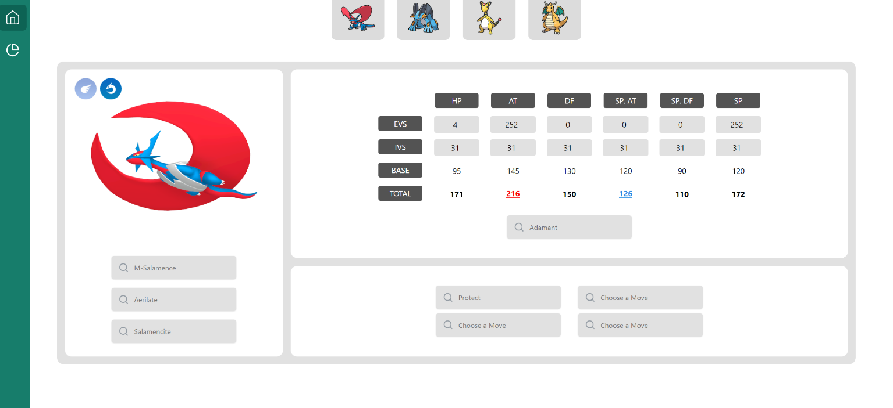

# Pokemon Maison Ultimate
Hello everyone!
My name is Yuri and I'm a Computer Scientist in Galicia, northwest of Spain.
<br>  I'm really into Pokemon, Data analysis, and Frontend web development, and I'm excited to share my latest project with you.

My personal goal: win at least once in Battle Maison from Pokemon Omega Ruby and Alpha Sapphire to become a true Pokemon Master!!

> [!IMPORTANT]
> This project is under construction. Your feedback is highly valuable and will greatly assist me in making improvements

<br> 
<div style="text-align:center" align="center">
  
</div>

## Project setup

1. To set up the project, you'll need to have Node.js and npm installed on your machine. You can download and install them from the [official Node.js website](https://nodejs.org/).

2. Clone this repository using Git Bash:

```bash
git clone https://github.com/juanyuri/MaisonUltimate.git
```

3. Install dependencies in the folder of the package.json
```bash
npm install
```

## Running the app

Use the following command to run the website

```bash
npm run dev
```

This will start a development server at <a href="http://localhost:5173">Localhost with port 5173</a>


## TODO:

- [x] Reactivity of Pokemon Classes in Team Planner View
- [x] Pokemon Team Planner View v.0.1
- [ ] Modify JSON of trainers to add Location from another languages
- [ ] Add all Trainers in Spanish games ORAS/XY
- [ ] Modify Team Planner View to add ADD, REMOVE, FILTERING Pokemon. (Design First in Adobe XD)
- [ ] Make smaller Components and distribute Responsibilities across them
- [ ] MVP. Minimum Viable Project
- [ ] Document all Changes from start of the project until now

> [!NOTE]
> There may be more features in the future!
